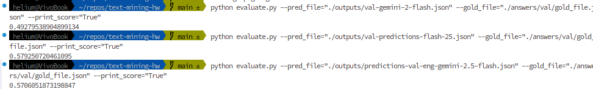
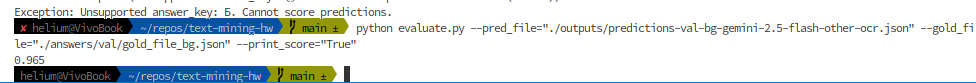
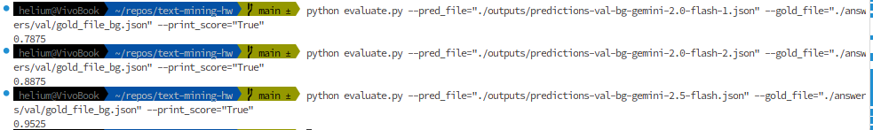

# Text Mining HW: ImageCLEF 2025 MultiModal Reasoning 

* Participation in English Language sub-competition 
* Participation in Bulgarian Language sub-competition

## Approach 
* Data Preparation consisted of merging respective parquette files and consequent filtering for language-specific question entries.
* Vision QA was performed with Vision Language Models (VLM). Textual and visual information was extracted through VLMs' input processing.
  * OCR (with [Tesseract](https://github.com/tesseract-ocr/tesseract)) prompt enrichment proved itself useful for Bulgarian QA, however, showed slight decrease in performance in English QA case.    
* This mini-project utilizes the Google `GenAI` [API](https://ai.google.dev/api?lang=python). Two prompts were tested with respect to querying several gemini models - one encouraging more restrictive output structure. Prompt templates can be found in `utils` module.
* While several Gemini models were tested, only results of the two best-performing models on val set were submitted.
  * experiments with `gemma` and `gemini-1.5-flash` were carried out but showed less favourable accuracy 
  * `gemini-2.0-flash` and  `gemini-2.5-flash-preview-04-17` showed best results on val set
    * since `2.5-flash` has reasoning/thinking option, a budget of 1024 tokens was set
* Output post-processing - several techniques were applied: 
  * (1) for older and less-advanced models such as `1.5-flash` producing conclusion by prompting another model was optimal for answer-key extraction
  * (2) more advanced models provided final answer as last sentence allowing for answer key to be easily obtained with simple `regex`
  * (3) for Bulgarian a trivial mapping from answer keys to English alphabet was performed

## Evals on val set

#### (i) Install dependencies  
```sh 
pip install -r requirements.txt
```

#### (ii) Evaluate val-set performance for best performing models 

1. English
* for `2.0-flash`
```sh
python evaluate.py --pred_file="./outputs/val-gemini-2-flash.json" --gold_file="./answers/val/gold_file.json" --print_score="True"
```

* for `2.5-flash-preview-04-17`
```sh 
python evaluate.py --pred_file="./outputs/val-predictions-flash-25.json" --gold_file="./answers/val/gold_file.json" --print_score="True"
```

* for `2.5-flash-preview-04-17` with OCR

```sh
python evaluate.py --pred_file="./outputs/predictions-val-eng-gemini-2.5-flash.json" --gold_file="./answers/val/gold_file.json" --print_score="True" 
```



* for `2.5-flash-preview-04-17` with other OCR


```sh
python evaluate.py --pred_file="./outputs/predictions-val-bg-gemini-2.5-flash-other-ocr.json" --gold_file="./answers/val/gold_file_bg.json" --print_score="True"
```

2. Bulgarian 
* for `2.0-flash`, no OCR

```sh
python evaluate.py --pred_file="./outputs/predictions-val-bg-gemini-2.0-flash-1.json" --gold_file="./answers/val/gold_file_bg.json" --print_score="True"
```
* for `2.0-flash` with OCR
```sh 
python evaluate.py --pred_file="./outputs/predictions-val-bg-gemini-2.0-flash-2.json" --gold_file="./answers/val/gold_file_bg.json" --print_score="True"
```

* for `2.5-flash-preview-04-17` with OCR
```sh
python evaluate.py --pred_file="./outputs/predictions-val-bg-gemini-2.5-flash.json" --gold_file="./answers/val/gold_file_bg.json" --print_score="True"
```


💡 These outputs have been produced with the stricter prompt template.


## Acknowledgements 

* The `evaluate.py` script is taken from competition [repo](https://github.com/mbzuai-nlp/ImageCLEF-2025-MultimodalReasoning)  
* Competition [data](https://huggingface.co/datasets/MBZUAI/EXAMS-V/viewer/default/test?views%5B%5D=test)
* Competition [homepage](https://www.imageclef.org/2025/multimodalreasoning)